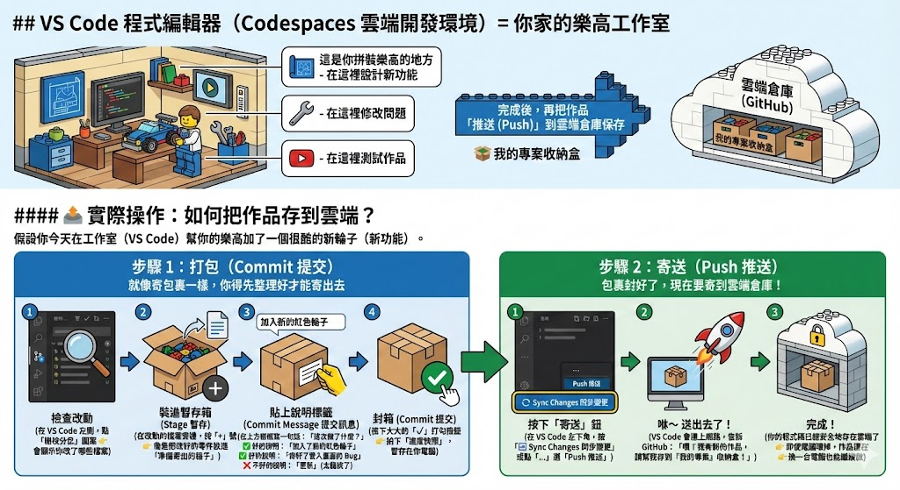
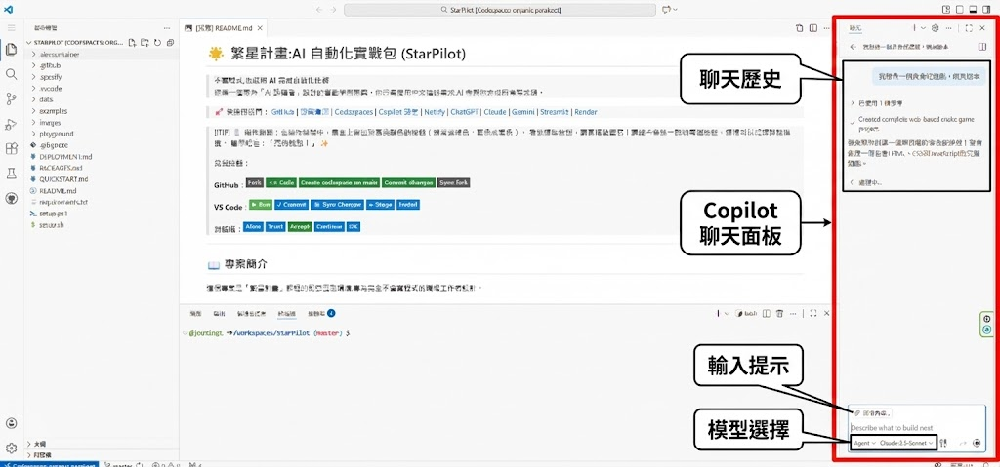

# 🌟 繁星計畫:AI 自動化實戰包 (StarPilot)

> **不寫程式,也能用 AI 完成自動化任務**  
> 這是一個專為「AI 詠唱者」設計的實戰學習專案。你只需要用中文描述需求,AI 會幫你完成所有程式碼。

> 🚀 **快速傳送門**：
> [GitHub](https://github.com/) | [專案倉庫](https://github.com/JB-Ming/StarPilot) | [Codespaces](https://github.com/codespaces) | [Copilot 設定](https://github.com/settings/copilot) | [Netlify](https://app.netlify.com) | [ChatGPT](https://chat.openai.com) | [Claude](https://claude.ai) | [Gemini](https://gemini.google.com) | [Streamlit](https://share.streamlit.io) | [Render](https://render.com)

> [!TIP]
> **🖱️ 操作原則**：在操作過程中，畫面上會出現**高亮顏色的按鈕**（通常是綠色、藍色或紫色）。
> 看到這些按鈕，**請直接點擊它**！講師不會逐一說明每個按鈕，這樣可以加速課程進度。
> 簡單記住：**「亮的就點！」** ✨
>
> **常見按鈕**：
> 
> **GitHub**：    
> 
> **VS Code**：    
> 
> **對話框**：    

---

## 📖 專案簡介

這個專案是「繁星計畫」課程的配套實戰環境,專為**完全不會寫程式的職場工作者**設計。

### 🚀 課程核心信念

> **「沒有做不到，只有你想不到」**

在這個 AI 時代，科技已經不是問題，**真正的門檻是「想像力」和「知道工具的存在」**。

#### 為什麼很多人覺得自己「不會」？

其實不是你「做不到」，而是：

1. **不知道的不知道（Unknown Unknowns）**
   - 你不知道有什麼工具可以幫你
   - 你不知道原來這些事情可以自動化
   - 你不知道 AI 已經進化到這個程度

2. **工具使用的障礙**
   - 不是沒有能力，而是沒有接觸過工具
   - 不是學不會，而是不知道從哪裡開始
   - 不是做不到，而是沒有人告訴你方法

#### 這門課要幫你突破什麼？

✅ **打破「不知道的不知道」**
   - 讓你知道：原來這些事情都能自動化
   - 讓你知道：有哪些工具可以實現你的需求
   - 讓你知道：AI 可以幫你做到什麼程度

✅ **取代重複無聊的工作**
   - 生活中：整理照片、重新命名檔案、批次處理文件
   - 工作中：數據彙整、報表生成、定期監控
   - 讓你把時間花在「有創造力」的事情上

✅ **真正提升生產力**
   - 不是「學會寫程式」，而是「學會用 AI 解決問題」
   - 不是「記住語法」，而是「知道如何描述需求」
   - 不是「成為工程師」，而是「成為 AI 協作者」

#### 現在的科技，問題不是「做不做得到」

而是：
- 你有沒有**想法**？（我想自動化什麼？）
- 你有沒有**好點子**？（這個流程可以更聰明嗎？）
- 你知不知道**有這個可能性**？（原來可以這樣做！）

這門課的使命，就是幫你：
1. **開啟想像力**：原來這些都能自動化
2. **認識工具**：知道有哪些 AI 助手可以幫你
3. **實際應用**：帶著自動化工具回到工作崗位

> 💡 **記住**：限制你的不是技術，而是「不知道原來可以這樣做」。  
> 這門課會告訴你：**是的，你想到的都做得到。**

---

### 💡 核心理念

你**不需要**:
- ❌ 學習任何程式語言語法
- ❌ 看懂程式碼在寫什麼
- ❌ 理解技術細節
- ❌ 除錯或修改程式碼

你**只需要**:
- ✅ 用中文清楚描述你的需求
- ✅ 學會如何與 AI 對話
- ✅ 理解任務的邏輯步驟
- ✅ 測試結果是否符合預期

### 🎯 學習目標

- ✅ 掌握與 AI 協作的核心技巧(需求描述 & 對話技巧)
- ✅ 用自然語言自動化日常工作(檔案整理、數據分析、網頁爬蟲)
- ✅ 建立可重複使用的自動化工具,帶回部門實際應用
- ✅ 體驗從「想法」到「執行成果」的完整流程

---

## 💭 關於本專案的文件產出流程

這份文件是如何產生的？分享給你我的創作流程：

### 📝 第一階段：構思與初稿（使用通用 AI 平台）

當我有了一個想法時，我會先：

1. **前往通用 AI 聊天平台**
   - ChatGPT、Gemini、Claude 等平台
   - 用自然對話的方式，說明我的構想
   - 例如：「我想做一個教非工程師用 AI 自動化工作的課程...」

2. **快速驗證想法**
   - 讓 AI 幫我釐清思路
   - 產生初步的文件架構
   - 確認方向是否可行

3. **產生文件初稿**
   - 取得基礎的 README 框架
   - 列出主要章節和內容大綱
   - 作為後續細化的基礎

### 🎯 第二階段：開啟專案與深度協作（使用 GitHub Copilot）

確認方向後，我會：

1. **在 GitHub 建立專案資料夾**
   - 開啟 VS Code 或 Codespaces
   - 將初稿內容貼到 README.md

2. **選定語言模型進行深度對話**
   - 啟用 GitHub Copilot Chat
   - 就像現在我跟你（AI 助手）聊天一樣
   - 用對話方式逐步完善內容

3. **在實際環境中優化文件**
   - 「我覺得這段說明太技術化，能改成白話文嗎？」
   - 「可以加一個實際操作範例嗎？」
   - 「這裡學員可能會不懂，能補充說明嗎？」

### 🔄 為什麼這樣做？

**初期用通用 AI 平台**：
- ✅ 快速驗證想法可行性
- ✅ 不受限於特定開發環境
- ✅ 適合天馬行空的構思階段

**後期在專案中用 Copilot**：
- ✅ 直接在實際檔案上修改
- ✅ AI 能看到專案結構和其他檔案
- ✅ 修改立即生效，所見即所得
- ✅ 可以隨時測試和驗證內容

### 💡 給學習者的啟示

**這就是我們想教你的協作方式**：

1. **想法階段**：用 ChatGPT/Gemini 快速驗證
2. **實作階段**：在專案中用 Copilot 深度協作
3. **持續優化**：透過對話不斷改進

這份 README 不是一次寫完的，而是透過：
- 與 AI 多次對話
- 反覆調整用詞
- 新增實際案例
- 根據使用者回饋優化

**最後產生你現在看到的這份文件。**

> 📌 **重點**：寫文件不再是「對著空白畫面發呆」，而是「和 AI 助手對話」。  
> 你說你的想法，AI 幫你組織成結構化的內容。

---

## 🚀 快速開始（5 分鐘上手）

> 💼 **特別適合有資安限制的公司環境**：
> - 不需要在公司電腦安裝任何軟體
> - 所有開發環境都在雲端
> - 只需要瀏覽器就能完成所有操作

### ⚡ 一鍵快速佈署（最快方式）

如果你想立即開始,不想經過 Fork 流程:

[](https://codespaces.new/你的GitHub帳號/StarPilot?quickstart=1)

點擊上方按鈕,直接在 Codespaces 中開啟本專案（需先登入 GitHub）

> 💡 **提醒**：這個方式會在你的 GitHub 帳號中自動 Fork 專案並啟動 Codespaces

### 📋 教學用快速佈署（推薦給講師）

如果你是講師,需要為學員批次建立環境:

1. **建立課程專用組織**（Organization）
   - 前往 [https://github.com/organizations/plan](https://github.com/organizations/plan)
   - 選擇免費方案建立組織（例如：`StarPilot-Course-2024`）

2. **匯入專案範本**
   - 在組織中點擊「New repository」
   - 選擇「Import a repository」
   - 輸入本專案網址：`https://github.com/你的帳號/StarPilot`

3. **設定課程權限**
   - 邀請學員加入組織（Settings → Members → Invite member）
   - 每位學員可以直接在組織專案中開啟自己的 Codespaces
   - 講師可以查看所有學員的進度

4. **提供給學員的連結**
   ```
   https://github.com/你的組織名稱/StarPilot
   ```
   學員點擊連結 → 登入 GitHub → 點擊「Code」→ 開啟 Codespaces

> 🎓 **優點**：
> - 學員不需要 Fork（簡化流程）
> - 講師可以統一更新教材
> - 所有學員使用相同版本
> - 方便追蹤學習進度

---

### 📦 標準佈署流程（個人學習）

### 步驟零：註冊 GitHub 帳號（第一次使用）

如果你還沒有 GitHub（程式碼協作平台）帳號，請先完成註冊：

1. **前往 GitHub 註冊頁面**
   - 開啟瀏覽器，前往 [https://github.com/signup](https://github.com/signup)

2. **填寫註冊資訊**
   - **Email**：填入你的常用電子郵件（建議使用公司信箱或個人信箱）
   - **Password**：設定一個安全的密碼（至少 8 個字元，包含數字和小寫字母）
   - **Username**：選擇一個使用者名稱（這會是你的 GitHub 識別碼）
   - **Country/Region**：選擇「Taiwan」

3. **驗證你的帳號**
   - GitHub 會要求你完成一個簡單的驗證（例如：解謎題）
   - 選擇是否要接收產品更新（可以不勾選）
   - 點擊「Create account」

4. **驗證電子郵件**
   - 檢查你的信箱，會收到一封來自 GitHub 的驗證信
   - 點擊信中的驗證連結，或輸入驗證碼

5. **完成設定**
   - GitHub 可能會詢問一些問卷（可以跳過）
   - 完成後你就可以開始使用了！

> 💡 **小提醒**：
> - 建議使用常用信箱，因為 GitHub 會寄送重要通知
> - 使用者名稱之後可以改，但改了之後專案連結也會變
> - 註冊完全免費，並且包含免費的 Codespaces 額度

---

### 🤔 什麼是 GitHub？（白話文說明）

**簡單來說**：GitHub 就像是「程式碼的雲端硬碟」，但功能更強大。

#### 🧱 用「蓋樂高」來理解（最白話版）

想像一下你在玩樂高：

**GitHub = 超大的樂高雲端倉庫 + 團隊俱樂部**
```
📦 這是一間雲端倉庫
   - 你和朋友都可以在這裡存放樂高作品
   - 不怕家裡的樂高被弟弟弄壞
   - 隨時都能拿出來繼續拼

🤝 這也是一個俱樂部
   - 大家可以分享作品
   - 可以一起合作蓋大型作品
   - 可以學習別人的創意
```

**Repository 儲存庫（簡稱 Repo）= 你的專案收納盒**
```
📦 在倉庫裡，每個專案都有自己的收納盒
   
   例如：
   📦 我的無敵小遊戲
   📦 自動整理檔案工具
   📦 銷售分析儀表板
   
   每個盒子上都貼了標籤
   裡面裝著這個專案的所有零件（程式碼、圖片、文件）
```

**VS Code 程式編輯器（Codespaces 雲端開發環境）= 你家的樂高工作室**
```
🏠 這是你拼裝樂高的地方
   - 在這裡設計新功能
   - 在這裡修改問題
   - 在這裡測試作品
   
   完成後，再把作品「推送 (Push)」到雲端倉庫保存
```

---

#### 📤 實際操作：如何把作品存到雲端？



假設你今天在工作室（VS Code）幫你的樂高加了一個很酷的新輪子（新功能）。

**步驟 1：打包（Commit 提交）**
```
就像寄包裹一樣，你得先整理好才能寄出去

1️⃣ 檢查改動
   在 VS Code 左側，點「樹枝分岔」圖案（Source Control 原始檔控制）
   👉 會顯示你改了哪些檔案
   
2️⃣ 裝進暫存箱（Stage 暫存）
   在改動的檔案旁邊，按「+」號
   👉 像是把改好的零件放進「準備寄出的箱子」
   
3️⃣ 貼上說明標籤（Commit Message 提交訊息）
   在上方框框寫一句話：「這次做了什麼？」
   
   ✅ 好的說明：「加入了新的紅色輪子」
   ✅ 好的說明：「修好了登入畫面的 Bug」
   ❌ 不好的說明：「更新」（太籠統了）
   
4️⃣ 封箱（Commit 提交）
   按下大大的「✓」打勾按鈕
   👉 拍下「進度快照」，暫存在你電腦
```

**步驟 2：寄送（Push 推送）**
```
包裹封好了，現在要寄到雲端倉庫！

1️⃣ 按下「寄送」鈕
   在 VS Code 左下角，按「🔄 Sync Changes 同步變更」
   或點「...」選「Push 推送」
   
2️⃣ 咻～ 送出去了！
   VS Code 會連上網路，告訴 GitHub：
   「嘿！我有新的作品，請幫我存到『我的專案』收納盒！」
   
3️⃣ 完成！
   你的程式碼已經安全地存在雲端了
   👉 即使電腦壞掉，作品還在
   👉 換一台電腦也能繼續做
```

---

#### 用生活例子來理解

**情境 1：個人專案管理**
```
就像你的 Google Drive 或 OneDrive：
- 把你的專案檔案全部存在雲端
- 隨時隨地可以存取
- 不怕電腦壞掉資料不見

不同的是：
✅ 可以看到「每次修改的歷史記錄」
✅ 可以「回到過去任何一個版本」
✅ 可以「同時嘗試不同的想法」而不影響原版
```

**舉例**：
```
你今天改了一個檔案，明天又改了
後天發現「還是前天的版本比較好」
👉 GitHub 可以讓你「倒帶」回到前天的狀態
```

---

**情境 2：多人協作（Collaboration）**
```
就像 Google 文件的「共同編輯」：
- 多人可以同時在同一個專案工作
- 每個人的修改都會被記錄
- 不會互相覆蓋對方的工作

不同的是：
✅ 可以先在「自己的分身版本」做修改
✅ 確認沒問題後，再「合併」回主要版本
✅ 如果有衝突，系統會提醒你處理
```

**舉例**：
```
你和同事一起做專案：
- 你負責 A 功能，同事負責 B 功能
- 兩人各自在自己的「分支」工作
- 做完後再「合併」在一起
👉 不會互相干擾，也不會弄亂對方的進度
```

---

**情境 3：分享與學習（Open Source 開源）**
```
就像 YouTube 或 Instagram：
- 可以把你的專案「公開分享」給全世界
- 其他人可以「複製」你的專案去改
- 大家可以「互相學習」優秀的作品

不同的是：
✅ 複製別人的專案叫「Fork 複製分支」
✅ 你改的版本不會影響原作者
✅ 如果改得很好，可以「建議」原作者採用
```

**舉例**：
```
你看到一個很棒的工具專案：
1. 點「Fork」複製到自己帳號
2. 隨意修改，加入自己想要的功能
3. 如果覺得這功能很實用
4. 可以「Pull Request 提交請求」請原作者考慮加入
👉 這就是開源社群（Open Source Community）的精神！
```

---

#### 為什麼這門課要用 GitHub？

1. **Repository 儲存庫（專案倉庫，簡稱 Repo）= 你的學習資料夾**
   ```
   StarPilot 這個專案就是一個 Repository（簡稱 Repo）
   裡面有：
   - 所有範例程式
   - 測試資料
   - 說明文件
   - 設定檔案
   ```

2. **Fork 複製分支 = 複製一份屬於你自己的**
   ```
   原始的 StarPilot 是講師的版本
   你 Fork（複製）後，會有一個「你自己的 StarPilot」
   👉 你可以隨意修改，不會影響原版
   👉 講師更新教材時，你也可以「同步」更新
   ```

3. **Codespaces 雲端開發空間 = 雲端開發環境**
   ```
   直接在瀏覽器裡開啟專案
   不需要在自己電腦安裝任何軟體
   👉 公司電腦有資安限制也能用
   👉 所有設定都自動完成
   ```

---

#### 實際操作流程（這門課）

```
第 1 步：Fork 複製專案
「老師，我要複製一份教材到我的帳號」
↓
第 2 步：開啟 Codespaces
「我要在雲端開啟這個專案」
↓
第 3 步：開始學習
「現在我有自己的學習環境了」
↓
第 4 步：做練習
「我可以隨意修改，不會弄壞原本的教材」
↓
第 5 步：儲存進度
「我的修改會自動存在我的 GitHub 帳號」
```

---

#### 常見問題

**Q：我改錯了怎麼辦？**
```
A：隨時可以「回到之前的版本」
   或者重新 Fork 一份新的
```

**Q：講師更新教材，我要怎麼拿到新版？**
```
A：可以「Sync 同步」講師的更新到你的版本
   或者重新 Fork（複製）一份
```

**Q：我的專案會被別人看到嗎？**
```
A：預設是公開的（別人只能看，不能改）
   你也可以設定成「私人」
```

**Q：GitHub 要錢嗎？**
```
A：個人使用完全免費
   包含：
   - 無限專案
   - 每月 120 小時 Codespaces 免費額度
   - GitHub Copilot 教育方案（免費）
```

---

> 💡 **記住**：
> - **GitHub** = 程式碼的雲端保存與協作平台
> - **Repository (Repo) 儲存庫** = 一個專案的資料夾
> - **Fork 複製分支** = 複製專案到自己帳號
> - **Codespaces 雲端空間** = 雲端開發環境
> - **Commit 提交** = 打包你的修改
> - **Push 推送** = 上傳到雲端
>
> 你不需要懂太多技術細節，只要會「Fork 複製」和「開啟 Codespaces」就能開始學習了！

---

### ✅ 課前準備檢查清單（學員用）

在課程開始前，請確認以下項目：

- [ ] **已註冊 GitHub 帳號**（步驟零）
- [ ] **已登入 GitHub**（確認右上角顯示你的頭像）
- [ ] **已申請 GitHub Copilot**（教育或試用方案）
  - 前往：[https://github.com/settings/copilot](https://github.com/settings/copilot)
  - 確認顯示「GitHub Copilot is active」
- [ ] **瀏覽器已開啟**（建議使用 Chrome、Edge、Firefox）
- [ ] **網路連線穩定**（Codespaces 需要持續連線）

> 📧 **講師準備事項**：
> - 提前發送課程專案連結給學員
> - 提醒學員提前註冊帳號（避免課堂時間浪費）
> - 準備 Copilot 試用申請教學（學員可能沒有權限）

---

### 步驟一：Fork 複製這個專案

1. 登入你的 GitHub 帳號
2. 點擊本頁面右上角的 **Fork 複製** 按鈕
3. 這會將專案複製一份到你的帳號下（你可以隨意修改，不會影響原始版本）

### 步驟二：啟動 Codespaces 雲端開發環境

1. 在你的 Fork 專案頁面，點擊綠色的 **<> Code 程式碼** 按鈕
2. 切換到 **Codespaces 雲端空間** 頁籤
3. 點擊 **Create codespace on main 建立雲端空間**
4. 等待 2-3 分鐘，耐心等候環境自動設置

> 💡 **完全自動化，零安裝困擾**：
> - ✅ 自動配置完整開發環境（Python、Node.js 等）
> - ✅ 自動安裝 30+ 個常用套件（pandas、streamlit、requests 等）
> - ✅ 自動啟用 GitHub Copilot AI 助手
> - ✅ 自動建立專案資料夾結構
> 
> **你完全不需要執行任何安裝指令！** 環境啟動完成後，直接開始使用。
> 
> ⚡ **適合公司資安環境**：不需要在本機安裝任何軟體，所有操作都在雲端完成。

#### ⚠️ Edge 無痕模式疑難排解

如果使用 **Edge 無痕模式 (InPrivate)** 開啟 Codespaces 時出現「Oh no, it looks like you are offline!」錯誤：

**原因**：Edge 無痕模式預設開啟嚴格的追蹤防護，會阻擋 Codespaces 需要的連線。

**解決方法**：

1. 在出現錯誤的頁面，點擊網址列左邊的 **🔒 鎖頭圖示**
2. 找到「**此網站的追蹤防護**」或「**Tracking prevention for this site**」
3. 點擊將它 **關閉**
4. 重新整理頁面，再點擊「**Retry connecting to the codespace**」

> 💡 **建議**：課程教學時建議使用 **Chrome** 或 **Edge 一般模式**，可避免此問題。

---

### 步驟三：開始與 AI 對話

1. 按 `Ctrl + I`（Mac 用 `Cmd + I`）開啟 Copilot Chat（AI 聊天助手）
2. 用中文告訴 AI 你想做什麼,例如:
   - 「幫我建立一個整理下載資料夾的工具」
   - 「我想分析這個 Excel 檔案的銷售數據」
   - 「幫我寫一個自動重新命名照片的腳本」
3. AI 會自動生成所有需要的程式碼
4. 點擊「執行」或「Run」按鈕,查看結果

> 💡 **重點**:你完全不需要看程式碼!專注在「描述需求」和「確認結果」即可。

#### 🖥️ Codespaces 介面說明



| 區域 | 位置 | 功能說明 |
|------|------|----------|
| **聊天歷史** | 右上角 | 查看過去與 AI 的對話記錄 |
| **Copilot 聊天面板** | 右側 | 與 AI 對話的地方，輸入你的需求 |
| **輸入提示** | 右側下方 | 輸入問題或指令給 AI |
| **模型選擇** | 右下角 | 選擇 AI 模型（建議使用 Claude 3.5 Sonnet） |

> 📖 **第一次使用？** 查看 [快速開始指南](QUICKSTART.md) 取得更詳細的步驟說明。

---

## 📂 專案結構

```
StarPilot/
│
├── .devcontainer/          # 🔧 自動化環境設定（你不需要動它）
│   └── devcontainer.json
│
├── examples/               # 📚 範例任務集合(每個都有完整的需求描述)
│   │
│   ├── 00_遊戲開發/
│   │   └── 任務說明.md           # 🎮 用 AI 做貪食蛇、俄羅斯方塊
│   │
│   ├── 01_檔案整理/
│   │   ├── 任務說明.md           # 📁 如何用 AI 整理檔案（含進階 Excel 範例）
│   │   └── 測試資料_待整理/      # 📦 22 個測試檔案（PDF、Word、圖片、影片、Excel）
│   │       ├── README.md         # 📝 測試資料說明與練習情境
│   │       └── attend.xlsx       # 📊 出勤資料（含敏感資料匿名化、工作表合併範例）
│   │
│   ├── 02_數據分析/
│   │   ├── 任務說明.md           # 📊 如何用 AI 分析 Excel
│   │   └── 測試資料/
│   │       ├── sales_data.csv    # 銷售數據（38 筆）
│   │       ├── customer_data.csv # 客戶資料（20 筆）
│   │       └── employee_records.csv # 員工資料（15 筆）
│   │
│   ├── 03_批次處理/
│   │   ├── 任務說明.md           # ⚙️ 如何批次重新命名、轉換格式
│   │   └── 測試資料/
│   │       ├── 待重新命名/       # 10 張混亂檔名的圖片
│   │       ├── 圖片資料/         # 5 個 PNG 檔案（格式轉換用）
│   │       └── README.md         # 📝 批次處理練習指南
│   │
│   ├── 04_網頁爬蟲/
│   │   ├── 任務說明.md           # 🕷️ 如何抓取網頁資料
│   │   └── 測試資料/
│   │       └── sample_urls.txt   # 測試用網址清單
│   │
│   ├── 05_自動化報告/
│   │   ├── 任務說明.md           # 📈 如何自動生成報表
│   │   └── 測試資料/
│   │       ├── sales_data.csv    # 銷售數據（11 筆）
│   │       └── README.md         # 📝 報告練習指南
│   │
│   ├── 06_互動介面/
│   │   ├── 任務說明.md           # 🎨 如何建立 Streamlit 介面
│   │   └── 測試資料/
│   │       ├── sample_data.csv   # 測試數據（6 筆）
│   │       └── README.md         # 📝 Streamlit 快速指令
│   │
│   ├── 07_定時任務/
│   │   ├── 任務說明.md           # ⏰ 如何設定自動執行排程
│   │   └── 測試資料/
│   │       └── README.md         # 📝 排程設定教學
│   │
│   ├── 08_部署到雲端/
│   │   ├── 任務說明.md           # 🚀 如何部署到雲端
│   │   ├── streamlit_範例_銷售儀表板.py
│   │   ├── render_範例_價格監控API.py
│   │   ├── requirements.txt      # 部署所需套件
│   │   ├── render.yaml           # Render 部署設定
│   │   └── .gitignore
│   │
│   ├── 09_Excel進階處理/
│   │   ├── 任務說明.md           # 📊 敏感資料匿名化 + 合併工作表
│   │   └── 測試資料/
│   │       ├── attend.xlsx       # 出勤資料（多工作表範例）
│   │       └── README.md         # 📝 練習情境說明
│   │
│   ├── 10_CRUD通訊錄/
│   │   ├── 任務說明.md           # 📇 CRUD 資料庫操作 + 免費雲端資料庫
│   │   └── 測試資料/
│   │       ├── sample_contacts.csv   # 範例聯絡人（10 筆）
│   │       ├── sample_contacts.json  # JSON 格式範例
│   │       └── README.md         # 📝 測試資料使用說明
│   │
│   └── README.md           # 📚 範例總覽與學習路徑
│
├── playground/             # 🎨 自由實驗區
│   └── your_project_here/
│
├── data/                   # 📊 測試用資料集
│   ├── sales.csv           # 範例銷售數據
│   └── README.md           # 📝 資料集使用說明
│
└── README.md               # 📖 你正在看的這份文件
```

### 🎓 認識專案結構（給新手的說明）

**為什麼要整理檔案結構？**

就像整理房間一樣，好的檔案結構讓你：
- ✅ 快速找到需要的檔案
- ✅ 團隊合作時大家都知道東西放哪
- ✅ 專案變大時不會亂成一團

**常見資料夾用途**

| 資料夾名稱 | 用途 | 範例內容 |
|------------|------|----------|
| `examples/` | 範例程式碼 | 教學用的範例、任務說明 |
| `data/` | 資料檔案 | CSV、Excel、JSON 資料 |
| `playground/` | 實驗區 | 你自己做的練習、測試程式 |
| `images/` | 圖片資源 | 截圖、圖示、素材 |
| `.devcontainer/` | 開發環境設定 | Codespaces 自動設定（不用動） |
| `.github/` | GitHub 設定 | 自動化流程設定（不用動） |

**常見檔案類型**

| 副檔名 | 說明 | 開啟方式 |
|--------|------|----------|
| `.md` | Markdown 文件 | GitHub 自動顯示格式 |
| `.py` | Python 程式 | 用 Python 執行 |
| `.html` | 網頁 | 用瀏覽器開啟 |
| `.csv` | 表格資料 | 用 Excel 或程式開啟 |
| `.xlsx` | Excel 檔案 | 用 Excel 開啟 |
| `.json` | 設定或資料 | 用文字編輯器開啟 |

**檔案命名的好習慣**

| ✅ 好的命名 | ❌ 不好的命名 | 原因 |
|-------------|---------------|------|
| `sales_data.csv` | `新增 資料夾.csv` | 避免空格和中文 |
| `snake_game.html` | `game.html` | 名字要有意義 |
| `report_2024_01.pdf` | `報告.pdf` | 加上日期方便識別 |
| `image_001.png` | `IMG_20241219_123456.jpg` | 統一格式、流水號 |

**💡 小技巧**：
- 資料夾和檔案名稱盡量用**英文小寫 + 底線**（snake_case）
- README.md 是每個資料夾的「說明書」，放在資料夾根目錄
- 把相關檔案放在同一個資料夾，不要全部堆在根目錄

### 🌐 程式語言分類入門（給新手的簡介）

程式語言百百種，但其實可以用「用途」來分類，這樣更好理解！

**🖥️ 前端（Frontend）- 使用者看得到的部分**

就是網頁上你看得到、摸得到的東西（按鈕、文字、圖片、動畫）。

| 語言 | 用途 | 一句話解釋 |
|------|------|------------|
| **HTML** | 網頁結構 | 就像房子的骨架 |
| **CSS** | 網頁樣式 | 就像房子的裝潢、油漆 |
| **JavaScript** | 網頁互動 | 讓網頁會動、會反應 |

> 💡 這三個是「網頁三劍客」，學網頁必學！

**⚙️ 後端（Backend）- 使用者看不到的幕後**

處理資料、計算、儲存，就像餐廳的廚房。

| 語言 | 特色 | 誰在用？ |
|------|------|----------|
| **Python** | 簡單易學、萬用 | AI、資料分析、自動化（本課程主要使用）|
| **C#** | 強型別、企業級 | 微軟生態系、遊戲開發 (Unity)、企業應用 |
| **JavaScript (Node.js)** | 前後端通吃 | 新創公司最愛 |
| **Java** | 穩定、企業級 | 銀行、大公司 |
| **PHP** | 老牌網頁語言 | WordPress、很多舊網站 |
| **Go** | 快速、現代 | Google 開發的 |
| **Ruby** | 優雅、快速開發 | 日本很流行 |

**📱 APP 開發 - 手機上的應用程式**

| 類型 | 語言 | 說明 |
|------|------|------|
| **iOS（iPhone）** | Swift、Objective-C | Apple 官方語言 |
| **Android** | Kotlin、Java | Google 官方語言 |
| **跨平台** | Flutter (Dart)、React Native (JS) | 一次寫，兩個平台都能用 |

**🗄️ 資料庫語言 - 儲存和查詢資料**

| 語言 | 用途 |
|------|------|
| **SQL** | 查詢關聯式資料庫（MySQL、PostgreSQL）|
| **NoSQL** | 非關聯式資料庫（MongoDB、Firebase）|

**🤖 AI / 機器學習**

| 語言 | 說明 |
|------|------|
| **Python** | AI 領域的霸主，幾乎所有 AI 都用它 |
| **R** | 統計分析專用 |

---

**🎯 簡單記憶法**

```
想做網頁？ → HTML + CSS + JavaScript（前端）
想做 AI？  → Python
想做 APP？ → Swift (iOS) / Kotlin (Android) / Flutter (跨平台)
想做自動化？→ Python（本課程重點！）
```

> 💡 **本課程的定位**：
> 我們主要使用 **Python**，因為它是最容易入門、用途最廣的語言。
> 另外也會稍微帶到 **C#**，因為很多企業（特別是微軟生態系）都在用它。
> 而且，你根本不需要真的會寫程式 —— **讓 AI 幫你寫就好！**

---

## 📋 常用英文單字（快速複製）

部署到 Netlify、GitHub Pages 等平台時，可能需要輸入英文檔名或設定。以下是常用單字，點擊即可複製：

### 🎮 遊戲專案

| 中文 | 英文檔名 | 專案名稱 |
|------|----------|----------|
| 貪食蛇 | `snake_game.html` | `snake-game` |
| 俄羅斯方塊 | `tetris_game.html` | `tetris-game` |
| 打磚塊 | `breakout_game.html` | `breakout-game` |
| 2048 | `game_2048.html` | `game-2048` |
| 踩地雷 | `minesweeper.html` | `minesweeper` |

### 📊 工具專案

| 中文 | 英文檔名 | 專案名稱 |
|------|----------|----------|
| 銷售儀表板 | `sales_dashboard.py` | `sales-dashboard` |
| 檔案整理工具 | `file_organizer.py` | `file-organizer` |
| 價格監控 | `price_monitor.py` | `price-monitor` |
| 資料分析 | `data_analysis.py` | `data-analysis` |
| 自動化報告 | `auto_report.py` | `auto-report` |

### 🚀 部署設定

| 用途 | 常用值 |
|------|--------|
| 部署資料夾 | `playground` |
| 主程式檔案 | `app.py` 或 `main.py` |
| 套件清單 | `requirements.txt` |
| 啟動指令 | `streamlit run app.py` |
| Python 環境 | `Python 3` |

### 📁 資料夾名稱

| 中文 | 英文 |
|------|------|
| 遊樂場 | `playground` |
| 資料 | `data` |
| 報告 | `reports` |
| 備份 | `backup` |
| 輸出 | `output` |
| 測試 | `test` |

> 💡 **提示**：專案名稱通常使用小寫字母和連字號（kebab-case），例如 `my-project-name`

---

## 🎓 學習路徑(由淺入深)

### 🎮 階段零：暖身 - 做個有趣的遊戲

**任務位置**：`examples/00_遊戲開發/`

**目標**：用最有趣的方式體驗 AI 協作，5 分鐘做出一個可以玩的遊戲！

**為什麼從遊戲開始？**
- ✅ **立即看到成果**：遊戲做出來就能玩，成就感滿滿
- ✅ **自然學會對話**：在調整遊戲中學會如何描述需求
- ✅ **降低焦慮感**：比起「工作任務」，遊戲更輕鬆有趣
- ✅ **快速迭代**：先做基本版→加功能→美化，體驗完整開發流程

**你會學到**：
- 如何用一句話讓 AI 生成完整遊戲
- 如何逐步加入新功能（計分、加速、音效）
- 如何調整遊戲難度和外觀
- 如何在「試玩→改進→再試玩」中優化作品

**範例（你可以這樣說）**：

```
我想做一個貪食蛇遊戲，網頁版本
```

```
可以加上計分板和速度提升嗎？每吃 5 個食物速度變快一點
```

```
可以讓畫面更好看嗎？蛇的顏色改成綠色漸層，背景改成深色
```

> 💡 **推薦起手式**：「幫我做一個貪食蛇/俄羅斯方塊遊戲」

#### 🎯 可做的專案
| 難度 | 專案 | 說明 |
|------|------|------|
| 入門 | 🐍 貪食蛇 | 用網頁版，5 分鐘做出來 |
| 入門 | 🧱 俄羅斯方塊 | 經典配色，7 種方塊 |
| 中級 | 🏓 打磚塊 | 彈球反彈物理 |
| 中級 | 🎮 2048 | 數字合併邏輯 |
| 進階 | 💣 踩地雷 | 遞迴展開演算法 |

#### 💬 對話範例
```
👤：我想做一個貪食蛇遊戲，網頁版本
🤖：（生成完整 HTML/JavaScript 遊戲）

👤：可以加上計分板和速度提升嗎？每吃 5 個食物速度變快一點
🤖：（加入計分系統和難度遞增機制）

👤：可以讓畫面更好看嗎？蛇的顏色改成綠色漸層，背景改成深色
🤖：（美化視覺效果）
```

---

### 🎈 階段一：入門 - 檔案整理

**任務位置**：`examples/01_檔案整理/`

**目標**：用 AI 自動整理混亂的資料夾，按類型、日期分類檔案

#### 📂 測試資料
| 類型 | 數量 | 檔案範例 |
|------|------|----------|
| PDF 文件 | 3 個 | 2024年度銷售報告.pdf, 會議記錄_0315.pdf |
| Word 文件 | 4 個 | 產品手冊_v2.docx, budget_2024.docx |
| JPG 圖片 | 5 個 | 產品照片_001.jpg, team_photo_2024.jpg |
| PNG 圖片 | 4 個 | logo_design.png, chart_2024Q1.png |
| MP4 影片 | 4 個 | 培訓影片_20240115.mp4, 產品展示_demo.mp4 |
| Excel 檔案 | 1 個 | attend.xlsx（進階練習用） |

#### 💬 對話情境
| 情境 | 對話範例 |
|------|----------|
| 基本分類 | 「把 PDF 和 Word 放到文件資料夾，JPG 和 PNG 放到圖片資料夾」|
| 日期分類 | 「按照修改日期的年月建立子資料夾」|
| 安全確認 | 「先預覽會移動哪些檔案，確認後再執行」|

#### 📊 進階練習：Excel 處理
- **敏感資料匿名化**：把姓名、身分證字號改成亂數假資料
- **合併工作表**：把多個「計算」開頭的工作表合併成一個

> 💡 **關鍵技巧**：把需求說得越具體，AI 的結果就越準確

---

### � 階段二A：數據分析

**任務位置**：`examples/02_數據分析/`

**目標**：用 AI 分析 Excel/CSV 資料，生成圖表和報告

#### 📂 測試資料
| 檔案 | 內容 | 適合練習 |
|------|------|----------|
| `sales_data.csv` | 銷售數據（38 筆） | 趨勢分析、排名統計 |
| `customer_data.csv` | 客戶資料（20 筆） | 分組統計、會員分析 |
| `employee_records.csv` | 員工資料（15 筆） | 多維度分析、薪資對比 |

#### 💬 對話情境
| 情境 | 對話範例 |
|------|----------|
| 基本分析 | 「分析 sales_data.csv，告訴我哪個產品賣最好」|
| 視覺化 | 「繪製每月銷售趨勢圖，製作地區銷售圓餅圖」|
| 互動儀表板 | 「用 Streamlit 做成可篩選日期的互動式儀表板」|
| 自動報告 | 「輸出成 Excel 報告，包含圖表和統計數字」|

#### 🎯 挑戰任務
- 🥇 初級：找出銷售額最高的月份
- 🥈 中級：建立互動式銷售儀表板
- 🥉 高級：結合多個資料來源進行交叉分析

---

### ⚙️ 階段二B：批次處理

**任務位置**：`examples/03_批次處理/`

**目標**：批次重新命名、格式轉換、內容修改

#### 📂 測試資料
| 資料夾 | 內容 | 適合練習 |
|--------|------|----------|
| `待重新命名/` | 10 張混亂檔名的 JPG 圖片 | 批次重新命名 |
| `圖片資料/` | 5 個 PNG 檔案 | 格式轉換、壓縮 |

#### 💬 對話情境
| 情境 | 對話範例 |
|------|----------|
| 批次重新命名 | 「改成：旅遊_001.jpg、旅遊_002.jpg，按修改日期排序」|
| 格式轉換 | 「把 PNG 轉成 JPG，壓縮到 500KB 以下」|
| 批次修改 | 「把所有 Word 文件中的『股份有限公司』改成『有限公司』」|
| 按規則分類 | 「檔名有日期的移到『有日期』資料夾」|

#### 🎯 挑戰任務
- 🥇 初級：將所有圖片重新命名為有意義的名稱
- 🥈 中級：根據檔案類型自動分類到不同資料夾
- 🥉 高級：建立智能命名工具（根據圖片內容自動命名）

---

### 🕷️ 階段二C：網頁爬蟲

**任務位置**：`examples/04_網頁爬蟲/`

**目標**：自動從網頁抓取資料，支援批次抓取和監控變化

#### ⚠️ 重要提醒
- 遵守網站的 robots.txt 規則
- 加上請求延遲（1-2 秒）避免被封鎖
- 僅用於學習和個人用途

#### 💬 對話情境
| 情境 | 對話範例 |
|------|----------|
| 抓取文字 | 「抓取這個網頁的文章標題和內容」|
| 批次抓取 | 「從 urls.txt 清單批次抓取所有網頁的標題」|
| 抓取表格 | 「抓取網頁上的表格，轉換成 Excel」|
| 監控變化 | 「每小時檢查價格，變動時通知我」|

#### 🎯 挑戰任務
- 🥇 初級：抓取新聞網站的最新 10 則標題
- 🥈 中級：建立價格監控機器人
- 🥉 高級：建立每日定時爬蟲並發送通知

---

### 📈 階段三A：自動化報告

**任務位置**：`examples/05_自動化報告/`

**目標**：自動生成 Excel、PowerPoint、PDF 報告

#### 📂 測試資料
- `sales_data.csv`：11 筆銷售數據

#### 💬 對話情境
| 情境 | 對話範例 |
|------|----------|
| Excel 報告 | 「生成包含統計摘要和圖表的 Excel 報告」|
| PowerPoint | 「做成 5 頁專業風格的 PPT，包含封面和圖表」|
| PDF 報告 | 「生成 PDF 月報，包含執行摘要和分析圖表」|
| 定時執行 | 「每週一早上 9 點自動生成報告」|

#### 🎯 挑戰任務
- 🥇 初級：生成包含 3 張圖表的 Excel 報告
- 🥈 中級：建立可重複使用的報告範本
- 🥉 高級：報告生成後自動寄送給相關人員

---

### 🎨 階段三B：互動介面

**任務位置**：`examples/06_互動介面/`

**目標**：用 Streamlit 建立美觀易用的網頁介面

#### 📂 測試資料
- `sample_data.csv`：6 筆測試資料

#### 💬 對話情境
| 情境 | 對話範例 |
|------|----------|
| 檔案上傳 | 「讓使用者上傳 Excel，顯示資料摘要」|
| 互動儀表板 | 「選擇日期範圍和產品類別，圖表即時更新」|
| 表單收集 | 「問卷表單：姓名、部門、滿意度，提交後存到 CSV」|
| 多頁應用 | 「首頁→資料上傳→數據分析→報告下載」|

#### 🎨 Streamlit 常用元件
| 類型 | 元件 |
|------|------|
| 輸入 | `text_input()`, `file_uploader()`, `date_input()` |
| 選擇 | `selectbox()`, `multiselect()`, `slider()` |
| 顯示 | `dataframe()`, `metric()`, `line_chart()` |
| 版面 | `columns()`, `tabs()`, `sidebar` |

---

### ⏰ 階段三C：定時任務

**任務位置**：`examples/07_定時任務/`

**目標**：設定自動執行的排程任務，24/7 不間斷運作

#### 💬 對話情境
| 情境 | 對話範例 |
|------|----------|
| 每日報表 | 「每天早上 8 點自動生成昨天的銷售報表」|
| 週期備份 | 「每週日晚上 11 點備份資料夾到雲端」|
| 價格監控 | 「每小時檢查價格，變動時 Line 通知」|
| 每日摘要 | 「週一到週五早上 8:30 寄送數據摘要信」|

#### ⏰ 排程設定方式
| 方式 | 特點 |
|------|------|
| Windows 工作排程器 | 內建、圖形介面、開機自動執行 |
| Python schedule 套件 | 簡單易用、適合 Python 專案 |
| Cron（Linux/Mac） | 強大靈活、適合伺服器 |

---

### 🚀 階段四：部署到雲端

**任務位置**：`examples/08_部署到雲端/`

**目標**：將你的工具部署到雲端，讓同事、朋友都能直接使用

#### 📂 範例檔案
- `streamlit_範例_銷售儀表板.py`：可運作的 Streamlit 範例
- `render_範例_價格監控API.py`：可運作的 Flask API 範例
- `requirements.txt`：部署所需套件
- `render.yaml`：Render 部署設定

#### 🌐 平台比較
| 功能 | Streamlit Cloud | Render |
|------|----------------|--------|
| **適合應用** | Streamlit 儀表板 | 任何 Python 應用 |
| **免費額度** | 無限制 | 750 小時/月 |
| **部署速度** | 1-2 分鐘 | 3-5 分鐘 |
| **自動部署** | ✅ Push 到 GitHub 就更新 | ✅ |
| **推薦給** | 數據分析、報表 | 爬蟲、API、排程 |

#### 💬 對話範例
```
👤：我想把這個銷售儀表板部署到網路上
🤖：（準備 requirements.txt，說明 Streamlit Cloud 部署步驟）

👤：部署成功！但應用有點慢
🤖：（說明免費方案限制，建議使用快取優化）
```

#### 🎯 挑戰任務
- 🥇 初級：部署一個簡單的 BMI 計算器
- 🥈 中級：部署一個加上密碼保護的工具
- 🥉 高級：部署一個每日自動執行的爬蟲，結果存到資料庫

---

### 📊 階段五：Excel 進階處理

**任務位置**：`examples/09_Excel進階處理/`

**目標**：處理複雜 Excel 任務：敏感資料匿名化、多工作表合併

#### 📂 測試資料
| 工作表名稱 | 內容 | 說明 |
|------------|------|------|
| `員工名單` | 員工基本資料 | 含姓名、身分證字號（約 30 筆） |
| `計算0901` ~ `計算1028` | 每日出勤計算 | 20 個「計算」開頭的工作表 |

#### 💬 對話情境
| 情境 | 對話範例 |
|------|----------|
| 匿名化 | 「把姓名和身分證改成亂數假資料，保持關聯性」|
| 合併工作表 | 「把所有『計算』開頭的工作表合併成一個」|
| 產生對照表 | 「匿名化後產生一份對照表，以便日後還原」|
| 匯出 CSV | 「合併後匯出成 CSV，使用 UTF-8 with BOM 編碼」|

#### 💬 對話範例
```
👤：幫我處理 attend.xlsx，把所有工作表中的敏感資料做匿名化：
    - 姓名改成亂數中文假名
    - 身分證字號改成亂數假號碼
    要保持資料的關聯性（同一個人的假資料要一致）
🤖：（讀取所有工作表，建立對照表，替換敏感資料）

👤：幫我把所有「計算」開頭的工作表合併成一個
🤖：（垂直合併 20 個工作表，加上來源欄位）
```

#### 🎯 挑戰任務
- 🥇 初級：把員工名單的姓名換成假名
- 🥈 中級：完整匿名化所有工作表，保持關聯性
- 🥉 高級：先合併再匿名化再匯出 CSV（多步驟組合）

---

### 📇 階段六：CRUD 通訊錄（資料庫入門）

**任務位置**：`examples/10_CRUD通訊錄/`

**目標**：用免費雲端資料庫（Supabase）建立一個完整的通訊錄管理系統，學習資料的新增、讀取、更新、刪除操作

#### 🗄️ 什麼是 CRUD？

| 縮寫 | 英文 | 中文 | 通訊錄範例 |
|------|------|------|------------|
| **C** | Create | 新增 | 新增一位聯絡人 |
| **R** | Read | 讀取 | 查看聯絡人清單 |
| **U** | Update | 更新 | 修改聯絡人資料 |
| **D** | Delete | 刪除 | 刪除一位聯絡人 |

> 💡 CRUD 是所有資料管理系統的基礎！掌握 CRUD，就能做客戶管理、庫存系統、訂單系統等各種應用。

#### 🌟 免費雲端資料庫比較

| 平台 | 類型 | 免費額度 | 推薦用途 |
|------|------|----------|----------|
| **Supabase** ⭐ | PostgreSQL | 500 MB、無限 API | 本範例使用，最推薦！ |
| Firebase | NoSQL | 1 GB、5萬讀取/天 | 即時應用、手機 App |
| Airtable | 表格式 | 1,000 筆 | 簡單資料管理 |
| MongoDB Atlas | NoSQL | 512 MB | 彈性資料結構 |

#### 📂 測試資料
| 檔案 | 內容 | 說明 |
|------|------|------|
| `sample_contacts.csv` | 10 筆範例聯絡人 | CSV 格式，可用於批次匯入 |
| `sample_contacts.json` | 10 筆範例聯絡人 | JSON 格式 |

#### 💬 對話情境
| 情境 | 對話範例 |
|------|----------|
| 建立系統 | 「用 Streamlit 做通訊錄，連接 Supabase，有新增、查看、編輯、刪除功能」|
| 加入搜尋 | 「加上搜尋功能，可以用姓名、電話、公司搜尋」|
| 加入分類 | 「幫聯絡人加上分類標籤：家人、朋友、同事、客戶」|
| 批次匯入 | 「讓使用者上傳 CSV，預覽後批次匯入到資料庫」|
| 匯出功能 | 「加一個按鈕把所有聯絡人匯出成 Excel」|

#### 💬 對話範例
```
👤：我想用 Streamlit 做通訊錄，連接 Supabase 資料庫
🤖：好的！請提供你的 Supabase Project URL 和 API Key...
    （生成完整程式碼：資料庫連接、新增表單、列表顯示、編輯刪除功能）

👤：可以加上搜尋功能嗎？
🤖：（加入即時搜尋功能，可按姓名、電話、公司搜尋）

👤：我想讓介面更好看
🤖：（美化介面：側邊欄功能選單、卡片式顯示、圖示標記）
```

#### 🎯 挑戰任務
- 🥇 初級：成功連接 Supabase，完成 CRUD 四大功能
- 🥈 中級：加入搜尋、分類標籤、美化介面
- 🥉 高級：加入批次匯入匯出、部署到 Streamlit Cloud、加入登入功能

---

#### 📝 Supabase 註冊與設定教學

> 💡 **什麼是 Supabase？**
> Supabase 是一個免費的「後端即服務」平台，讓你不用架伺服器就能擁有資料庫和 API。

**步驟 1：註冊帳號**

```
1️⃣ 前往 https://supabase.com
2️⃣ 點擊右上角「Start your project」
3️⃣ 選擇「Continue with GitHub」（推薦！一鍵快速）
4️⃣ 在 GitHub 授權頁面點擊「Authorize supabase」
5️⃣ 完成新手問卷（可跳過）

✅ 註冊完成！
```

**步驟 2：建立專案**

```
1️⃣ 點擊「New Project」
2️⃣ 選擇或建立 Organization（組織）
   - 名稱隨意填，方案選「Free」
3️⃣ 填寫專案資訊：
   - Name：contacts-app
   - Database Password：設定密碼（請記住！）
   - Region：Northeast Asia (Tokyo)
4️⃣ 點擊「Create new project」
5️⃣ 等待 2-3 分鐘建立完成

✅ 專案建立成功！
```

**步驟 3：建立資料表**

```
1️⃣ 點擊左側「Table Editor」
2️⃣ 點擊「Create a new table」
3️⃣ 設定資料表：
   - Name：contacts
   - ❌ 取消勾選「Enable RLS」（教學用）
4️⃣ 新增欄位（Add column）：

   | 欄位 | 類型 | 說明 |
   |------|------|------|
   | id | int8 | 主鍵（自動） |
   | name | text | 姓名 |
   | phone | text | 電話 |
   | email | text | Email |
   | company | text | 公司 |
   | category | text | 分類 |
   | notes | text | 備註 |
   | created_at | timestamptz | 建立時間（預設 now()）|

5️⃣ 點擊「Save」儲存

✅ 資料表建立完成！
```

**步驟 4：取得 API 金鑰**

```
1️⃣ 點擊左側「Project Settings」⚙️
2️⃣ 點擊「API」
3️⃣ 複製以下兩個資訊：

   📋 Project URL：https://xxxxx.supabase.co
   📋 anon public key：eyJhbG...（很長一串）

⚠️ API 金鑰要保密，不要上傳到公開的 GitHub！
```

> 📖 **完整教學**：詳細步驟請參考 [examples/10_CRUD通訊錄/任務說明.md](examples/10_CRUD通訊錄/任務說明.md)

#### 🌐 快速部署方式

**方案 1：Netlify（最簡單！推薦新手）**

適合：靜態網頁、HTML 遊戲、展示頁面（操作更直覺）

```
步驟：
1️⃣ 訪問 Netlify
   - 前往：https://app.netlify.com
   - 點擊「Sign up with GitHub」使用 GitHub 帳號登入
   - 會出現「Authorize Netlify Auth」授權畫面
   - 點擊綠色的「Authorize netlify」按鈕允許授權
   
   > 💡 這是正常的授權流程，Netlify 需要存取你的 GitHub 才能部署專案

2️⃣ 快速完成 Onboarding 問卷
   登入後會出現一系列問題，快速填寫即可：
   
   📝 What is your name?
      - First name / Last name：填你的名字（隨意填都可以）
   
   📝 How are you planning to use Netlify?
      - 選擇「Personal」（個人使用）
   
   📝 What kind of project do you want to build first?
      - 選擇「Personal project」或「Games」都可以
   
   📝 What best describes your role?
      - 隨便選一個，例如「Other」
   
   📝 What is the name of your team?
      - 填一個簡單的名稱，例如：myteam
   
   ✅ 點擊「Continue to deploy」繼續

3️⃣ 略過 Deploy your first project 頁面
   - 會跳到「Deploy your first project」頁面
   - ❌ 不要在這裡點擊 GitHub
   - ✅ 點擊上方的「Skip this step for now」略過
   - 這樣會進入 Netlify 首頁

4️⃣ 在首頁新增專案
   - 首次進入會看到「Add your project to Netlify」頁面
   - 在「Import an existing project」區塊，點擊「Import from Git」按鈕
   - （之後再進入會改成點右上角綠色「Add new project」按鈕）

5️⃣ 連接 GitHub 倉庫
   - 會看到「Let's deploy your project with...」頁面
   - 點擊「GitHub」按鈕
   - 首次使用需授權 Netlify 存取你的 GitHub
   - 找到並選擇你的倉庫（例如：你的帳號/StarPilot）

6️⃣ 設定部署參數
   會看到「Review configuration for StarPilot」頁面，填寫以下欄位：
   
   📝 Team：保持預設（你的團隊名稱）
   📝 Project name：填 `你的名字-snake-game`（例如：`ming-snake-game`）
      ⚠️ 建議加上你的名字避免重複，這會成為網址的一部分
   📝 Branch to deploy：保持「master」或「main」
   📝 Base directory：填 `playground`
   📝 Build command：留空（靜態網頁不需要）
   📝 Publish directory：填 `playground`
   📝 Functions directory：留空或保持預設
   📝 Environment variables：不用設定
   
   ✅ 點擊「Deploy StarPilot」按鈕

7️⃣ 完成！
   - 等待約 30 秒～1 分鐘部署完成
   - Netlify 會自動生成網址：
     https://random-name-123456.netlify.app
   - 可以自訂網址：Site settings → Change site name
```

> 💡 **優點**：
> - ✅ 設定超級簡單，全程圖形化介面
> - ✅ 自動生成隨機網址，立即可用
> - ✅ 可以免費自訂子網域（your-name.netlify.app）
> - ✅ 每次 push 到 GitHub 自動重新部署
> - ✅ 提供部署歷史記錄，可回溯舊版本
> - ✅ 內建 CDN 加速，全球訪問更快
> - ✅ 免費 HTTPS 憑證

> 🎯 **推薦理由**：不需要設定分支、資料夾，Netlify 會自動處理一切！

#### 🔄 淺談 CI/CD：為什麼更新會自動生效？

當你在 Netlify 部署遊戲後，修改程式碼並 Push 到 GitHub，網站會自動更新。這就是 **CI/CD** 的概念！

**什麼是 CI/CD？（用白話文解釋）**

| 術語 | 全名 | 白話解釋 |
|------|------|----------|
| **CI** | Continuous Integration（持續整合）| 你每次 Push 程式碼，系統會自動檢查、測試 |
| **CD** | Continuous Deployment（持續部署）| 檢查通過後，自動把新版本發布到網路上 |

**傳統方式 vs CI/CD 方式**

```
❌ 傳統方式：
   修改程式碼 → 手動打包 → 手動上傳到伺服器 → 測試 → 完成
   （每次更新要花 10-30 分鐘）

✅ CI/CD 方式：
   修改程式碼 → Push 到 GitHub → 自動完成所有事情！
   （只要 30 秒～1 分鐘）
```

**Netlify 幫你做的事情**

```
你 Push 程式碼
     ↓
GitHub 通知 Netlify「有新版本了！」
     ↓
Netlify 自動抓取最新程式碼
     ↓
Netlify 自動部署到全球 CDN
     ↓
網站自動更新完成 ✅
```

> 💡 **重點**：你只需要專注在寫程式，其他的事情（測試、打包、部署）都自動化了！

> 🎓 **延伸學習**：大公司的軟體開發團隊都會使用 CI/CD，這是現代軟體開發的標準流程。你現在用 Netlify 已經在體驗真正的專業開發流程了！

---

**方案 2：部署到 Render（推薦，免費）**

適合：API、後端服務、定時任務

```
步驟：
1️⃣ 上傳到 GitHub
   - 確保專案包含 render.yaml 和 requirements.txt
   
2️⃣ 前往 https://render.com
   - 註冊或登入帳號（可用 GitHub 登入）
   
3️⃣ 連接 GitHub 倉庫
   - 點擊「New」→「Blueprint」
   - 選擇你的 GitHub 倉庫
   
4️⃣ 自動部署
   - Render 會讀取 render.yaml 自動設定
   - 等待部署完成（約 3-5 分鐘）
   
5️⃣ 取得網址
   - 部署完成後會顯示網址
   - 例如：https://your-app.onrender.com
```

**方案 3：部署到 Streamlit Cloud（推薦給網頁介面）**

適合：資料視覺化、互動式儀表板

```
步驟：
1️⃣ 訪問 Streamlit Community Cloud
   - 前往 https://share.streamlit.io
   - 會看到「Streamlit Community Cloud」首頁
   - 右側展示社群分享的各種應用範例
   - 點擊藍色的「Continue to sign-in」按鈕
   
2️⃣ 選擇登入方式
   - 會看到「登入 Streamlit Community Cloud」頁面
   - 有三種登入方式可選：
     • 「使用 Google 繼續」
     • 「使用 GitHub 繼續」← 推薦這個！
     • 或用電子郵件註冊
   - 點擊「使用 GitHub 繼續」（因為我們的程式碼在 GitHub 上）

3️⃣ GitHub 授權畫面
   - 會跳轉到「Authorize Streamlit Community Cloud」頁面
   - 顯示「Streamlit Community Cloud by Streamlit wants to access your ... account」
   - 點擊綠色的「Authorize streamlit」按鈕允許授權
   
   > 💡 這是正常的授權流程，Streamlit 需要讀取你 GitHub 上的程式碼

4️⃣ OTP 驗證（一次性密碼）
   - 授權後可能會要求 Email 驗證
   - 前往你的信箱收取驗證碼（6 位數字）
   - 在頁面輸入驗證碼完成驗證
   
   > ⚠️ 如果沒收到信，請檢查垃圾郵件資料夾

5️⃣ 填寫帳號資料（Set up your account）
   - First name：填你的名字
   - Last name：填你的姓氏
   - Primary email：會自動帶入 GitHub 的 Email
   - What's your functional area?：隨便選一個（例如：Other）
   - What stage of app development are you at?：隨便選一個
   - Country or region：選擇「Taiwan」
   - 點擊藍色的「Continue」按鈕

6️⃣ 進入 Streamlit 主控台
   - 註冊完成後會進入「Your apps」主控台頁面
   - 這裡會顯示你已部署的所有應用
   - 下方有「Get started from a template」範本可參考
   - 點擊右上角的「Create app」按鈕

7️⃣ 選擇部署方式
   - 會看到「What would you like to do?」頁面
   - 有三個選項：
     • Deploy a public app from GitHub ← 選這個！
     • Deploy a public app from a template
     • Deploy a private app in Snowflake
   - 點擊「Deploy now」（在 GitHub 選項下方）

8️⃣ 確保專案已推送到 GitHub
   - 確保專案包含：
     • Streamlit 程式檔案（例如：streamlit_snake_game.py）
     • requirements.txt 或 requirements_streamlit.txt（列出所需套件）
   - 使用 Git 推送到 GitHub（參考前面的 Commit & Push 教學）

9️⃣ 填入部署資訊（Deploy an app）
   會看到部署表單，填入以下資訊：
   
   📝 Repository：你的 GitHub 帳號/倉庫名稱
      - 格式：帳號/StarPilot
      - 也可以點右邊「Paste GitHub URL」直接貼網址
   
   📝 Branch：選擇分支
      - 通常是「master」或「main」
   
   📝 Main file path：你的 Streamlit 主程式路徑
      - 範例：examples/02_數據分析/sales_dashboard.py
      - ⚠️ 這個檔案必須存在於你的 GitHub 倉庫中！
   
   📝 App URL（optional）：自訂網址
      - 可以填一個好記的名稱，會變成 xxx.streamlit.app
   
   > ⚠️ 如果看到紅色錯誤提示（如「This file does not exist」），
   > 表示路徑填錯了，請確認檔案路徑正確

🔟 點擊「Deploy」按鈕

1️⃣1️⃣ Streamlit Cloud 會自動：
   ✅ 從 GitHub 拉取程式碼
   ✅ 安裝 requirements_streamlit.txt 中的依賴套件
   ✅ 運行 Streamlit 應用
   ✅ 生成公開 URL（例如：https://your-app-name.streamlit.app）

1️⃣1️⃣ 部署完成（約 2-3 分鐘）
   - 部署完成後會自動開啟你的應用
   - 取得專屬網址並分享給其他人
   - 以後修改程式碼並 push 到 GitHub，網站會自動更新！
```

> 💡 **推薦起手式**：「我想把這個工具部署到雲端，讓其他人也能用」
> 
> 🎁 **完全免費**：Streamlit Cloud 提供免費方案，包含：
> - 無限公開應用
> - 自動部署
> - HTTPS 加密
> - 免費的 streamlit.app 網域

---

## 🧙 與 AI 對話的技巧

### ✅ 好的需求描述（具體、明確、有脈絡）

**範例 1：檔案整理**
```
👤：我想整理 D:/Downloads 資料夾
    把所有檔案按照類型分類：
    - PDF 和 Word 放到「文件」資料夾
    - JPG 和 PNG 放到「圖片」資料夾  
    - MP4 和 AVI 放到「影片」資料夾
    其他檔案保持不動
```

**範例 2：數據分析**
```
👤：我有一個 sales.xlsx 檔案在 data 資料夾
    裡面有「日期」「產品」「數量」「金額」四個欄位
    我想知道：
    1. 哪個產品的總銷售額最高？
    2. 每個月的銷售趨勢如何？
    用圖表顯示結果
```

**範例 3：批次處理**
```
👤：我有 200 張照片需要重新命名
    目前檔名是隨機的，我想改成：
    旅遊_001.jpg
    旅遊_002.jpg
    旅遊_003.jpg
    這樣的格式
```

### ❌ 不好的需求描述（模糊、太簡略、缺乏細節）

```
👤：幫我整理檔案        ❌ 什麼檔案？怎麼整理？
👤：分析數據            ❌ 什麼數據？分析什麼？
👤：做個網頁            ❌ 什麼功能？給誰用？
```

### 🎯 黃金法則：說清楚「是什麼」、「在哪裡」、「要什麼」

**完整的需求描述包含**：

1. **目標**：我想做什麼？（整理檔案、分析數據、批次處理）
2. **對象**：針對什麼檔案/資料？（具體的檔案路徑、資料夾位置）
3. **細節**：有什麼具體要求？（分類方式、格式、條件）
4. **結果**：期望看到什麼？（報表、圖表、整理好的資料夾）

### 💬 與 Copilot Chat 對話的技巧

**開啟 Chat 快捷鍵**：
- Windows/Linux: `Ctrl + I`
- macOS: `Cmd + I`

**對話流程**：

```
👤：我想做一個XXX工具
🤖：好的，請問...[確認細節]

👤：[補充說明]
🤖：了解，我會...[開始生成]

👤：可以再加上YYY功能嗎？
🤖：沒問題...[修改完成]

👤：執行看看
🤖：[顯示執行結果]
```

**如果遇到問題**：
```
👤：執行失敗了，出現錯誤訊息 [貼上錯誤]
🤖：這是因為...，我已經修正了

👤：結果跟我預期的不一樣
🤖：請問你預期的結果是什麼？
```

> 💡 **重點**：把 AI 當成一個助理，清楚告訴他你要什麼，他會幫你完成所有技術細節

---

## 💡 常見問題 (FAQ)

### Q1: Copilot 沒有自動跳出建議?

**A**: 請確認：
1. 左下角是否顯示 Copilot 圖示（已啟用）
2. 註解結尾是否按下 `Enter` 並稍等 1-2 秒
3. 嘗試按 `Ctrl + Enter` 手動觸發建議面板

### Q2: 生成的程式碼有錯誤?

**A**: 這很正常！AI 不是 100% 完美。請：
1. 看錯誤訊息的關鍵字（通常在最後一行）
2. 在錯誤行上方寫註解：`# 修正上方的錯誤`
3. 或直接問 Copilot Chat：「為什麼會出現 XXX 錯誤?」

### Q3: 我完全不懂程式，真的可以嗎？

**A**: 可以！這就是這個專案的核心理念：
- 你只需要「描述需求」，不需要「寫程式碼」
- AI 會負責所有技術實作
- 你只要確認「結果是否正確」
- 就像跟助理溝通一樣，你不需要知道他怎麼做的

### Q4: 我可以用自己的資料嗎？

**A**: 當然！
1. 把你的檔案上傳到 Codespaces 的 `data/` 資料夾
2. 告訴 AI：「檔案在 data/xxx.xlsx」
3. AI 會自動處理，不需要你改任何東西

### Q5: Codespaces 會過期嗎?

**A**: 
- 免費額度：每月 120 核心小時（約 60 小時雙核使用）
- 30 天未使用會自動刪除,但你的程式碼會保留在 GitHub 上
- 隨時可以重新啟動（所有套件會自動重新安裝）

### Q6: 我需要手動安裝套件嗎？

**A**: **完全不需要！**
- Codespaces 啟動時會自動安裝所有需要的套件（30+ 個）
- 你不需要執行 `pip install`、`npm install` 等任何指令
- 你不需要擔心版本衝突或相容性問題
- 如果 AI 建議你安裝額外套件，直接對它說：「幫我執行安裝」

### Q7: 公司有資安限制，可以使用嗎？

**A**: **可以！這正是 Codespaces 的優勢**
- ✅ 不需要在公司電腦安裝任何軟體
- ✅ 所有開發環境都在雲端（GitHub 的伺服器）
- ✅ 只需要瀏覽器就能使用
- ✅ 程式碼儲存在你的 GitHub 帳號，隨時可以存取

### Q8: 我是講師，要如何為學員批次佈署環境？

**A**: 請查看 [📋 快速佈署指南（講師版）](DEPLOYMENT.md)
- 多種佈署方式：一鍵啟動、GitHub Organization、GitHub Classroom
- 詳細步驟說明和權限設定
- 常見問題排除和技術支援

---

## 🎁 學習資源

### 推薦學習路徑

1. **完成入門專案**（預計 2-3 小時）
   - 從遊戲開發開始，建立信心
   - 完成至少一個實用工具
   
2. **修改與擴展**（預計 3-5 小時）
   - 將範例套用到真實工作場景
   - 在 `playground/` 中建立自己的專案
   - 嘗試組合多個功能

3. **探索與精進**（持續進行）
   - 挑戰更複雜的整合應用
   - 分享你的作品給同事使用
   - 教導其他人如何使用 AI 協作

### 專案文件

**內建文件**（先看這些）：
- [🎮 遊戲開發範例](examples/00_遊戲開發/任務說明.md) - **推薦新手從這裡開始！**
- [🚀 快速佈署指南](DEPLOYMENT.md) - **講師必看！批次佈署和課程管理**
- [☁️ 部署到雲端](examples/08_部署到雲端/任務說明.md) - **讓你的工具上線，分享給全世界**
- [📦 已安裝的套件說明](PACKAGES.md) - 了解環境中有哪些工具可用（不需要背！）
- [🎨 Playground 使用指南](playground/README.md) - 建立你自己的專案
- [📊 範例資料說明](data/README.md) - 如何準備測試資料
- [📁 檔案整理範例](examples/01_檔案整理/任務說明.md) - 實用工作任務

### 官方文件與教學

**AI 協作工具**：
- [GitHub Copilot 官方文件](https://docs.github.com/en/copilot)
- [Copilot Chat 使用指南](https://docs.github.com/en/copilot/using-github-copilot/asking-github-copilot-questions-in-your-ide)
- [如何清楚描述需求](https://docs.github.com/en/copilot/using-github-copilot/prompt-engineering-for-github-copilot)

---

## 🤝 貢獻與反饋

這是一個開放的教學專案，歡迎：

- 🐛 回報 Bug（如果發現程式碼有問題）
- 💡 建議新功能（你希望增加什麼實戰案例？）
- 📝 分享你的成果（在 Issues 區展示你的作品！）

---

## 📜 授權

本專案採用 MIT 授權條款，你可以自由使用、修改、分享。

---

## 🌟 最後的話

> **「程式設計的未來，不是背語法，而是學會與 AI 協作。」**

在這個專案中，你不需要成為工程師，只需要：
- 保持好奇心 🔍（嘗試新的自動化可能）
- 願意嘗試錯誤 💪（第一次描述可能不完美，但可以調整）
- 學會提出好問題 💡（清楚描述需求）
- 理解問題的本質 🎯（知道自己真正要什麼）

當你完成這些學習階段，你已經掌握了「AI 時代的核心能力」：

- **需求分析**：知道自己到底要什麼，並能清楚表達
- **邏輯思維**：把大任務拆解成一步一步的小任務
- **溝通技巧**：精準地向 AI 描述需求，快速得到結果
- **驗證能力**：判斷 AI 產出的結果是否符合預期

這些能力不會過時，因為它們是**與 AI 協作的核心**，而不是技術細節。

### 🚀 接下來可以做什麼？

- **實戰應用**：在工作中找一個重複性任務，用學到的技能自動化它
- **分享成果**：在 Issues 區展示你的專案，啟發其他學習者
- **持續探索**：嘗試新的程式語言、框架、工具
- **教導他人**：最好的學習方式就是教別人

祝你在繁星計畫中，找到屬於你的那顆星！✨

---

**Made with ❤️ for everyone who wants to automate boring stuff with AI**

*「每個人都應該學會與 AI 協作，不是為了成為工程師，而是為了讓工作更有創造力。」*
